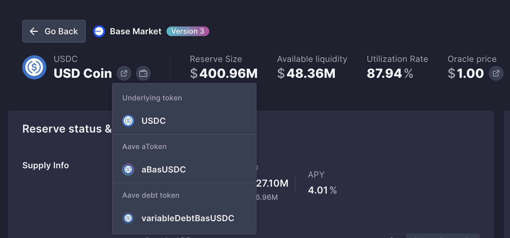
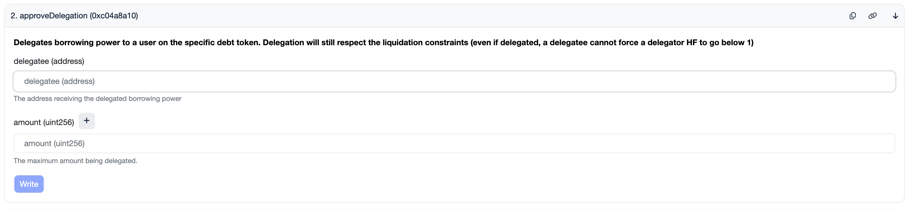

<p align="center">
  
</p>

<p align="center">
  <strong>Star us&nbsp;❤️&nbsp;→</strong>&nbsp;&nbsp;
  <a href="https://github.com/aaronjmars/agent-credit/stargazers"></a>&nbsp;&nbsp;
  <a href="../SKILL.md"></a>&nbsp;&nbsp;
  <a href="https://x.com/aaronjmars"></a>
</p>

<p align="center">
  <strong>Give your AI agent a credit line.</strong><br>
  It borrows from Aave when it needs funds and the debt accrues on your position - you choose which assets it can borrow, how much, and you can revoke anytime.
</p>

<p align="center">
  Borrowing requires <strong>Aave V3</strong>; status, repay, and setup also work against <strong>Aave V2</strong> (see <a href="../SKILL.md">SKILL.md</a> for why).<br>
  Preconfigured for Base, Ethereum, Polygon, and Arbitrum - but works on any EVM chain where Aave V3 is deployed.
</p>

<div align="center">

[](https://github.com/aaronjmars/agent-credit/stargazers)
[](https://github.com/aaronjmars/agent-credit/network/members)
[](https://aave.com)
[](../LICENSE)

</div>

## Compatible With

- **[OpenClaw](https://openclaw.ai/)** - Install as a skill and the agent can borrow autonomously
- **[Claude Code](https://www.npmjs.com/package/@anthropic-ai/claude-code)** - Run the scripts directly from a Claude Code session
- **Any agent framework** - The scripts are plain bash + Foundry's `cast`, so they work anywhere with a shell

Combines naturally with **[Bankr](https://bankr.bot/)** skills - borrow USDC via delegation, then use Bankr to swap, bridge, or deploy it. The agent gets a credit line *and* a full DeFi toolkit.

## What This Enables

- **Self-funding agents** - The agent borrows stablecoins or tokens to pay for operations without you manually transferring funds each time
- **On-demand liquidity** - Capital is drawn exactly when needed rather than sitting idle in the agent's wallet
- **Borrow + swap combos** - Borrow USDC via delegation, swap to any token via Bankr; the basis for autonomous DCA

The agent only needs a wallet with a tiny amount of ETH for gas. All real capital comes from your Aave position via delegation. Note the agent cannot borrow its way out of an empty gas tank - see [Step 4](#step-4-fund-the-agent-wallet-for-gas).

## How Credit Delegation Works

Credit delegation separates two things: **borrowing power** and **delegation approval**.

**Borrowing power is holistic.** It comes from your entire collateral position across all assets. If you deposit $10k worth of ETH at 80% LTV, you have $8k of borrowing capacity. That capacity isn't locked to any specific asset - it's a pool-wide number.

**Delegation approval is isolated per debt token.** You control *which* assets the agent can borrow and *how much* of each by calling `approveDelegation()` on individual VariableDebtTokens. Each asset has its own debt token contract, and each approval is independent.

```
Your Collateral (holistic)              Delegation Approvals (isolated)
┌─────────────────────────┐             ┌──────────────────────────────┐
│  $5k ETH                │             │  USDC DebtToken → agent: 500 │
│  $3k USDC               │  ───LTV───▶ │  WETH DebtToken → agent: 0.1 │
│  $2k cbETH              │   = $8k     │  cbETH DebtToken → agent: 0  │
│  Total: $10k @ 80% LTV  │  capacity   └──────────────────────────────┘
└─────────────────────────┘
```

So if you deposit ETH as collateral, you can approve the agent to borrow up to 500 USDC and 0.1 WETH - but not cbETH. The agent can only borrow what you've explicitly approved, but the *capacity* to borrow comes from your total collateral.

## Scripts

These scripts are for the **agent** to use. The delegator never runs them.

| Script | What it does |
|--------|-------------|
| `aave-setup.sh` | Verify config, dependencies, and delegation status |
| `aave-borrow.sh <SYMBOL> <AMOUNT>` | Borrow via delegation (runs 4 safety checks first) |
| `aave-repay.sh <SYMBOL> <AMOUNT\|max>` | Repay debt on behalf of the delegator |
| `aave-status.sh [SYMBOL] [--health-only] [--json]` | Check allowances, health factor, and debt |

Every borrow runs these checks before executing:
1. **Per-tx cap** - amount within configured limit
2. **Delegation allowance** - sufficient allowance on the debt token
3. **Health factor** - delegator's position stays healthy after borrow
4. **Gas balance** - agent wallet has enough ETH for the transaction

If any check fails, the borrow is aborted with a clear error.

## Agent Setup

The scripts need Foundry's `cast`, plus `jq` and `bc`:

```bash
curl -L https://foundry.paradigm.xyz | bash && foundryup
```

Config lives at `~/.openclaw/skills/aave-delegation/config.json` by default. Set `SKILL_DIR` to use another folder, or `CONFIG` to point at the file directly. Start from the example and fill in the agent key and your address:

```bash
mkdir -p ~/.openclaw/skills/aave-delegation
cp config.example.json ~/.openclaw/skills/aave-delegation/config.json
./aave-setup.sh
```

These env vars override the config when set: `AAVE_RPC_URL`, `AAVE_AGENT_PRIVATE_KEY`, `AAVE_DELEGATOR_ADDRESS`, `AAVE_POOL_ADDRESS`, `AAVE_MIN_HEALTH_FACTOR`, and `AAVE_BASE_CURRENCY_DECIMALS` (set to `18` on ETH-denominated V2 markets). Full agent instructions are in [SKILL.md](../SKILL.md).

Tests run offline against a mock `cast`, no RPC needed:

```bash
bash tests/test-borrow-contract.sh
bash tests/test-repay-contract.sh
```

## Safety

The agent never has access to your private key. It only holds its own key (for signing borrow/repay transactions) and your public address (to know whose position to borrow against).

**Your private key should never be in this folder, in the config, or in any script here.** This repo is the agent's workspace. All delegator actions (supplying collateral, approving delegation, revoking) are done from your own wallet through the Aave UI or a block explorer.

You control exposure through:
- **Delegation ceilings** per asset (set via `approveDelegation`)
- **Per-transaction caps** in the config (`safety.maxBorrowPerTx`)
- **Health factor floor** (`safety.minHealthFactor`, default 1.5)
- **Instant revocation** - set delegation to 0 at any time

See [safety.md](../safety.md) for the full threat model and emergency procedures.

---

# Delegator Setup Guide

Everything below is done from **your own wallet** - through the Aave web UI, a block explorer, or your preferred wallet app. You never need to clone this repo, run these scripts, or enter your private key anywhere here.

## Step 1: Supply Collateral

Go to [app.aave.com](https://app.aave.com), connect your wallet, and supply collateral (ETH, USDC, etc.). This is standard Aave usage - nothing specific to credit delegation yet.

If you already have a position on Aave, skip to Step 2.

## Step 2: Find the Debt Token

Each asset on Aave has a **VariableDebtToken** - that's the contract you approve delegation on. You need its address for every asset you want the agent to borrow.

### From the Aave UI

On [app.aave.com](https://app.aave.com), go to the reserve page for the asset. Click the token icon to expand a dropdown showing the underlying token, the aToken, and the **debt token** address:



Click the debt token address to open it on the block explorer - you'll need it for Step 3.

### From deployments.md

All debt token addresses for common assets are listed in [deployments.md](../deployments.md). Look up your chain and asset.

## Step 3: Approve Delegation

This is the key step. You call `approveDelegation()` on the VariableDebtToken to tell Aave: "this agent address can borrow up to X of this asset, and the debt goes on my position."

### Via block explorer (recommended)

1. Go to the VariableDebtToken address on the block explorer (Basescan, Etherscan, Polygonscan, etc.)
2. Click **Contract** → **Write Contract** → **Connect to Web3** (connect your wallet)
3. Find **`approveDelegation`** (function #2)
4. Fill in:
   - **delegatee**: the agent's wallet address
   - **amount**: the maximum borrow amount in **raw units** (see note below)
5. Click **Write** and confirm the transaction in your wallet



> **Raw units:** Amounts must be in the token's smallest unit. USDC has 6 decimals, so 500 USDC = `500000000`. WETH has 18 decimals, so 0.1 WETH = `100000000000000000`. See [deployments.md](../deployments.md) for decimals per asset.

### Approve multiple assets

Each asset has its own debt token. Repeat the process above for each asset you want the agent to borrow. For example:
- USDC VariableDebtToken → `approveDelegation(agent, 500000000)` - up to 500 USDC
- WETH VariableDebtToken → `approveDelegation(agent, 100000000000000000)` - up to 0.1 WETH

The agent cannot borrow any asset you haven't approved.

## Step 4: Fund the Agent Wallet for Gas

The agent wallet needs a small amount of ETH to pay for transaction gas. On Base, a borrow costs ~$0.01, so even 0.001 ETH goes a long way.

Send a tiny amount of ETH to the agent's address from your wallet (any wallet app, exchange, or bridge works).

This has to come from you. The agent cannot borrow gas for itself: the borrow's own gas check rejects the transaction precisely when the balance is too low, and a borrowed WETH balance is an ERC-20 that cannot pay gas without an unwrap that also costs gas.

## Step 5: Verify

Run the setup check to confirm everything is connected:

```bash
./aave-setup.sh
```

This shows delegation allowances per asset, your health factor, and whether the agent has gas. It only reads on-chain data - but it does need `agentPrivateKey` in config, because it derives the agent's address from it to check that address's allowances and balance.

---

## Managing Delegation

### Increase or change an allowance

Call `approveDelegation` again on the block explorer with the new amount. It **replaces** the previous value (not additive).

### Revoke delegation for one asset

Call `approveDelegation` on the debt token with amount = `0`. The agent can no longer borrow that asset.

### Revoke all delegation

Call `approveDelegation(..., 0)` on every VariableDebtToken you previously approved.

### Check outstanding debt

On [app.aave.com](https://app.aave.com), your dashboard shows all outstanding borrows. Any debt the agent created shows up here - it's on your position.

### Repay debt yourself

On [app.aave.com](https://app.aave.com), click **Repay** on any borrow. Standard Aave repayment - the agent doesn't need to be involved. The agent can also repay via `aave-repay.sh`.

---

## Safety Recommendations

- **Start small.** Approve $50-100 initially. Increase after you've tested the flow.
- **Never approve `type(uint256).max`.** Always set a concrete ceiling per asset.
- **Monitor your health factor.** Set up alerts on [app.aave.com](https://app.aave.com) or [DeFi Saver](https://defisaver.com).
- **Revoke when idle.** If the agent doesn't need to borrow for a while, set delegation to 0.
- **Prefer stablecoins for borrowing.** Borrowing USDC against ETH collateral is simpler to reason about than volatile-on-volatile.
- **Test on a testnet first.** Use Base Sepolia or Ethereum Sepolia with faucet tokens before real funds.

See [safety.md](../safety.md) for the full threat model and emergency procedures.

---

## Quick Reference

| Action | How |
|--------|-----|
| Supply collateral | [app.aave.com](https://app.aave.com) → Supply |
| Find debt token | [app.aave.com](https://app.aave.com) → Reserve page → token dropdown, or [deployments.md](../deployments.md) |
| Approve delegation | Block explorer → VariableDebtToken → `approveDelegation(agent, amount)` |
| Revoke delegation | Block explorer → VariableDebtToken → `approveDelegation(agent, 0)` |
| Check delegation | `./aave-status.sh` or block explorer → `borrowAllowance(you, agent)` |
| Monitor health | [app.aave.com](https://app.aave.com) dashboard |
| Repay debt | [app.aave.com](https://app.aave.com) → Repay, or agent runs `aave-repay.sh` |
| Fund agent gas | Send ETH to agent address from any wallet |

## Reference Files

| File | Contents |
|------|----------|
| [SKILL.md](../SKILL.md) | Agent-facing skill documentation |
| [deployments.md](../deployments.md) | All Aave V2/V3 contract + debt token addresses |
| [contracts.md](../contracts.md) | Core contract addresses and delegator setup commands |
| [safety.md](../safety.md) | Threat model, risk mitigations, emergency procedures |

## License

MIT, see [LICENSE](../LICENSE).

---

Built by [Aaron Elijah Mars](https://aaronjmars.com), founder of Aeon and MiroShark · [@aaronjmars](https://github.com/aaronjmars)
