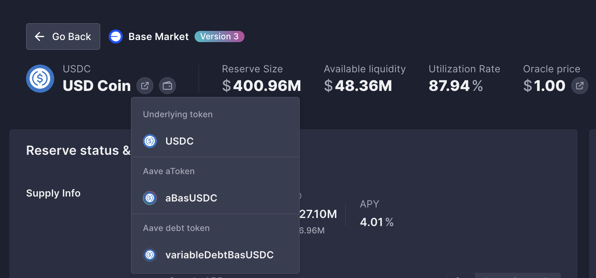
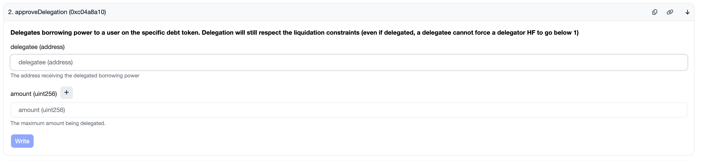

# Agent Credit — Aave Credit Delegation for AI Agents

Give your AI agent a credit line. It borrows from Aave when it needs funds, and the debt accrues on your position. You stay in control — you choose which assets it can borrow, how much, and you can revoke anytime.

Works on **Aave V2** and **Aave V3**, across Base, Ethereum, Polygon, and Arbitrum.

## What This Enables

- **Self-funding agents** — The agent borrows stablecoins or tokens to pay for operations without you manually transferring funds each time
- **Autonomous DCA** — Agent borrows USDC periodically to dollar-cost-average into ETH
- **Gas self-sufficiency** — Agent borrows a tiny amount of WETH to cover its own gas when it runs low
- **On-demand liquidity** — Agent accesses capital exactly when needed, not sitting idle in a wallet

The agent only needs a wallet with a tiny amount of ETH for gas. All real capital comes from your Aave position via delegation.

## How Credit Delegation Works

Credit delegation separates two things: **borrowing power** and **delegation approval**.

**Borrowing power is holistic.** It comes from your entire collateral position across all assets. If you deposit $10k worth of ETH at 80% LTV, you have $8k of borrowing capacity. That capacity isn't locked to any specific asset — it's a pool-wide number.

**Delegation approval is isolated per debt token.** You control *which* assets the agent can borrow and *how much* of each by calling `approveDelegation()` on individual VariableDebtTokens. Each asset has its own debt token contract, and each approval is independent.

```
Your Collateral (holistic)              Delegation Approvals (isolated)
┌─────────────────────────┐             ┌──────────────────────────────┐
│  $5k ETH                │             │  USDC DebtToken → agent: 500 │
│  $3k USDC               │  ───LTV───▶ │  WETH DebtToken → agent: 0.5 │
│  $2k cbETH              │   = $8k     │  cbETH DebtToken → agent: 0  │
│  Total: $10k @ 80% LTV  │  capacity   └──────────────────────────────┘
└─────────────────────────┘
```

So if you deposit ETH as collateral, you can approve the agent to borrow up to 500 USDC and 0.1 WETH — but not cbETH. The agent can only borrow what you've explicitly approved, but the *capacity* to borrow comes from your total collateral.

## Scripts

| Script | What it does |
|--------|-------------|
| `aave-setup.sh` | Verify config, dependencies, and delegation status |
| `aave-borrow.sh <SYMBOL> <AMOUNT>` | Borrow via delegation (runs 4 safety checks first) |
| `aave-repay.sh <SYMBOL> <AMOUNT\|max>` | Repay debt on behalf of the delegator |
| `aave-status.sh [SYMBOL] [--health-only] [--json]` | Check allowances, health factor, and debt |

Every borrow runs these checks before executing:
1. **Per-tx cap** — amount within configured limit
2. **Delegation allowance** — sufficient allowance on the debt token
3. **Health factor** — delegator's position stays healthy after borrow
4. **Gas balance** — agent wallet has enough ETH for the transaction

If any check fails, the borrow is aborted with a clear error.

## Safety

The agent never has access to your private key. It only holds its own key (for signing borrow/repay transactions) and your public address (to know whose position to borrow against).

You control exposure through:
- **Delegation ceilings** per asset (set via `approveDelegation`)
- **Per-transaction caps** in the config (`safety.maxBorrowPerTx`)
- **Health factor floor** (`safety.minHealthFactor`, default 1.5)
- **Instant revocation** — set delegation to 0 at any time

See [safety.md](safety.md) for the full threat model and emergency procedures.

---

# Delegator Setup Guide

This section walks you through setting up delegation so the agent can start borrowing.

## Prerequisites

Install [Foundry](https://book.getfoundry.sh/) for the `cast` CLI:

```bash
curl -L https://foundry.paradigm.xyz | bash && foundryup
```

Set your variables (this example uses Base — see [deployments.md](deployments.md) for other chains):

```bash
export YOUR_PK="0xYOUR_PRIVATE_KEY"
export YOUR_ADDRESS="0xYOUR_WALLET_ADDRESS"
export AGENT_ADDRESS="0xAGENT_WALLET_ADDRESS"

# Base V3
export RPC="https://mainnet.base.org"
export POOL="0xA238Dd80C259a72e81d7e4664a9801593F98d1c5"
export DATA_PROVIDER="0x2d8A3C5677189723C4cB8873CfC9C8976FDF38Ac"
```

## Step 1: Supply Collateral

You need collateral in Aave before anything can be borrowed against it. If you already have a position on Aave (via [app.aave.com](https://app.aave.com)), skip to Step 2.

```bash
TOKEN="0x4200000000000000000000000000000000000006"  # WETH on Base
AMOUNT="10000000000000000"                           # 0.01 WETH

# Approve the Pool to pull your tokens
cast send $TOKEN \
  "approve(address,uint256)" $POOL $AMOUNT \
  --private-key $YOUR_PK --rpc-url $RPC

# Supply to Aave
cast send $POOL \
  "supply(address,uint256,address,uint16)" \
  $TOKEN $AMOUNT $YOUR_ADDRESS 0 \
  --private-key $YOUR_PK --rpc-url $RPC
```

## Step 2: Find the Debt Token

Each asset on Aave has a **VariableDebtToken** — that's the contract you approve delegation on. You need to find its address for every asset you want the agent to borrow.

### Option A: From the Aave UI

On [app.aave.com](https://app.aave.com), go to the reserve page for the asset you want. Click the token icon to see the underlying token, the aToken, and the **debt token** address:



### Option B: From the command line

```bash
# Returns (aToken, stableDebtToken, variableDebtToken)
cast call $DATA_PROVIDER \
  "getReserveTokensAddresses(address)(address,address,address)" \
  $TOKEN_ADDRESS --rpc-url $RPC
```

The **3rd return value** is the VariableDebtToken.

### Option C: From deployments.md

All debt token addresses for common assets are listed in [deployments.md](deployments.md).

## Step 3: Approve Delegation

Call `approveDelegation()` on the VariableDebtToken. This tells Aave: "this agent address is allowed to borrow up to X of this asset, and the debt goes on my position."

### Via command line

```bash
VAR_DEBT_TOKEN="0x59dca05b6c26dbd64b5381374aAaC5CD05644C28"  # USDC debt token on Base

# Allow the agent to borrow up to 500 USDC (500 * 10^6 = 500000000)
cast send $VAR_DEBT_TOKEN \
  "approveDelegation(address,uint256)" \
  $AGENT_ADDRESS 500000000 \
  --private-key $YOUR_PK --rpc-url $RPC
```

### Via block explorer (Basescan / Etherscan)

1. Go to the VariableDebtToken contract on the block explorer
2. Click **Write Contract** → **Connect Wallet**
3. Find **`approveDelegation`**
4. Enter the agent address as `delegatee` and the amount in raw units as `amount`
5. Submit the transaction



> **Raw units:** USDC has 6 decimals, so 500 USDC = `500000000`. WETH has 18 decimals, so 0.1 WETH = `100000000000000000`. See [deployments.md](deployments.md) for decimals per asset.

### Approve multiple assets

Each asset has its own debt token — approve them separately:

```bash
# USDC — up to 500
cast send "0x59dca05b6c26dbd64b5381374aAaC5CD05644C28" \
  "approveDelegation(address,uint256)" $AGENT_ADDRESS 500000000 \
  --private-key $YOUR_PK --rpc-url $RPC

# WETH — up to 0.1
cast send "0x24e6e0795b3c7c71D965fCc4f371803d1c1DcA1E" \
  "approveDelegation(address,uint256)" $AGENT_ADDRESS 100000000000000000 \
  --private-key $YOUR_PK --rpc-url $RPC
```

The agent cannot borrow any asset you haven't approved.

## Step 4: Fund the Agent Wallet for Gas

The agent wallet needs a small amount of ETH to pay for transaction gas. On Base, a borrow costs ~$0.01, so even 0.001 ETH goes a long way.

```bash
cast send $AGENT_ADDRESS \
  --value 0.001ether \
  --private-key $YOUR_PK --rpc-url $RPC
```

## Step 5: Verify

```bash
# Check the delegation allowance
cast call $VAR_DEBT_TOKEN \
  "borrowAllowance(address,address)(uint256)" \
  $YOUR_ADDRESS $AGENT_ADDRESS --rpc-url $RPC

# Or run the full status check
./aave-status.sh
```

---

## Managing Delegation

### Increase an allowance

Call `approveDelegation` again. It **replaces** the previous value (not additive):

```bash
cast send $VAR_DEBT_TOKEN \
  "approveDelegation(address,uint256)" \
  $AGENT_ADDRESS 1000000000 \
  --private-key $YOUR_PK --rpc-url $RPC
```

### Revoke delegation for one asset

Set the allowance to 0:

```bash
cast send $VAR_DEBT_TOKEN \
  "approveDelegation(address,uint256)" \
  $AGENT_ADDRESS 0 \
  --private-key $YOUR_PK --rpc-url $RPC
```

### Revoke all delegation

Call `approveDelegation(..., 0)` on every VariableDebtToken you previously approved.

### Check outstanding debt

```bash
cast call $VAR_DEBT_TOKEN \
  "balanceOf(address)(uint256)" \
  $YOUR_ADDRESS --rpc-url $RPC
```

### Repay debt yourself

```bash
# Approve Pool to spend your tokens
cast send $TOKEN "approve(address,uint256)" $POOL $AMOUNT \
  --private-key $YOUR_PK --rpc-url $RPC

# Repay (use max uint to repay entire debt)
MAX_UINT="115792089237316195423570985008687907853269984665640564039457584007913129639935"
cast send $POOL \
  "repay(address,uint256,uint256,address)" \
  $TOKEN $MAX_UINT 2 $YOUR_ADDRESS \
  --private-key $YOUR_PK --rpc-url $RPC
```

---

## Safety Recommendations

- **Start small.** Approve $50-100 initially. Increase after you've tested the flow.
- **Never approve `type(uint256).max`.** Always set a concrete ceiling per asset.
- **Monitor your health factor.** Set up alerts on [app.aave.com](https://app.aave.com) or [DeFi Saver](https://defisaver.com).
- **Revoke when idle.** If the agent doesn't need to borrow for a while, set delegation to 0.
- **Prefer stablecoins for borrowing.** Borrowing USDC against ETH collateral is simpler to reason about than volatile-on-volatile.
- **Test on a testnet first.** Use Base Sepolia or Ethereum Sepolia with faucet tokens before real funds.

See [safety.md](safety.md) for the full threat model and emergency procedures.

---

## Quick Reference

| Action | Command |
|--------|---------|
| Supply collateral | `cast send $POOL "supply(address,uint256,address,uint16)" $TOKEN $AMOUNT $YOU 0` |
| Approve delegation | `cast send $VAR_DEBT "approveDelegation(address,uint256)" $AGENT $AMOUNT` |
| Check allowance | `cast call $VAR_DEBT "borrowAllowance(address,address)(uint256)" $YOU $AGENT` |
| Revoke delegation | `cast send $VAR_DEBT "approveDelegation(address,uint256)" $AGENT 0` |
| Check health factor | `cast call $POOL "getUserAccountData(address)(...)" $YOU` |
| Check debt | `cast call $VAR_DEBT "balanceOf(address)(uint256)" $YOU` |
| Fund agent gas | `cast send $AGENT --value 0.001ether` |

## Reference Files

| File | Contents |
|------|----------|
| [SKILL.md](SKILL.md) | Agent-facing skill documentation |
| [deployments.md](deployments.md) | All Aave V2/V3 contract + debt token addresses |
| [contracts.md](contracts.md) | Core contract addresses and delegator setup commands |
| [safety.md](safety.md) | Threat model, risk mitigations, emergency procedures |
